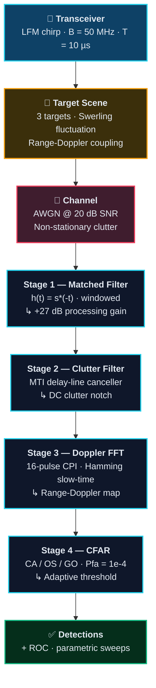

FFT-Based Digital Spectrum Analyzer and Pulse-Compression Radar Signal Chain
============================================================================
<p align="center">
  
</p>

<p align="center">
  <a href="#-quick-start">
    
  </a>
</p>

<p align="center">
  
  
  
  
</p>

<p align="center">
  <a href="docs/Project_report.pdf"></a>
  <a href="#-results-gallery"></a>
  <a href="radar_dsp_framework.m"></a>
  <a href="#-references"></a>
</p>


## 🛰️ What This Is

A **modular, end-to-end MATLAB radar DSP framework** that takes a scene of moving targets buried in
thermal noise and non-stationary clutter, and pulls them back out — through pulse compression,
clutter cancellation, Doppler processing, and adaptive thresholding.

Every block is a switch you can flip. Change one line in **Section 0** and the entire chain
reconfigures: swap the waveform, swap the window, swap the CFAR variant, swap the clutter filter,
swap the Swerling fluctuation model. Then watch the trade-offs appear in the plots.

> **Course:** CE363 — Digital Signal Processing · Complex Engineering Problem (CEP)
> **Author:** Hassan Khalid · Department of Computer Engineering · Reg. 2023435

<details>
<summary><b>📌 The core problem, in one paragraph</b></summary>

<br/>

Radar echo power falls off as $1/R^4$. By the time a return comes back from a few kilometres out,
it is often *orders of magnitude weaker* than the noise and clutter sitting on top of it.
Classical radar solved resolution with **short pulses** and range with **long pulses** — but you
cannot have both, because pulse duration sets range resolution *and* carries the energy.

**Pulse compression breaks that deadlock.** Transmit a long, frequency-swept pulse (all the energy),
then compress it in the receiver with a matched filter (all the resolution). What is left after that
is a detection problem in a background whose statistics *change with range* — which is exactly what
CFAR processing exists to solve. This framework implements the whole path.

</details>


## ⚡ Processing Pipeline




## 🎛️ The Switchboard

Everything below lives in **Section 0** of [`radar_dsp_framework.m`](radar_dsp_framework.m).
Change a string, rerun, compare.

| Knob | Field | Options | Default |
| :-- | :-- | :-- | :-- |
| 🌀 **Waveform** | `cfg.waveform_type` | `LFM` · `PhaseCode` (Barker-13) · `Hybrid` | `LFM` |
| 🪟 **Window** | `cfg.window_type` | `none` · `hamming` · `hanning` · `blackman` · `chebyshev` | `hamming` |
| 🎚️ **Detector** | `cfg.cfar_type` | `fixed` · `CA` · `OS` · `GO` | `CA` |
| 🧹 **Clutter Filter** | `cfg.clutter_filter` | `none` · `MTI` · `Doppler` (FIR BPF) · `Adaptive` (LMS) | `MTI` |
| 📉 **RCS Statistics** | `cfg.swerling_model` | `0` (Marcum) · `1` · `2` · `3` · `4` | `1` |
| 🌫️ **Clutter Type** | `cfg.clutter_type` | `none` · `white` · `nonstationary` | `nonstationary` |
| 🔊 **Input SNR** | `cfg.SNR_dB` | any dB value | `20` |
| 🛡️ **CFAR Geometry** | `cfg.cfar_guard` / `cfg.cfar_train` / `cfg.cfar_pfa` | integers / probability | `4` / `10` / `1e-4` |


## 📐 Radar Configuration

<table>
<tr><td valign="top" width="58%">

**System Parameters (X-Band)**

| Parameter | Symbol | Value |
| :-- | :--: | --: |
| Carrier frequency | $f_c$ | 10 GHz |
| Sampling frequency | $f_s$ | 200 MHz |
| Chirp bandwidth | $B$ | 50 MHz |
| Pulse duration | $T$ | 10 µs |
| Pulse repetition interval | $PRI$ | 200 µs |
| Coherent pulses (CPI) | $N_p$ | 16 |
| Time–bandwidth product | $BT$ | 500 |
| Processing gain | $10\log_{10}(BT)$ | **27.0 dB** |
| Range resolution | $c/2B$ | **3.0 m** |
| Max unambiguous range | $cT_{pri}/2$ | **30.0 km** |

</td><td valign="top" width="42%">

**Target Scene**

| # | Range | Velocity | RCS |
| :-: | --: | --: | --: |
| 🔴 **T1** | 1500 m | +30 m/s | 1.0 m² |
| 🟡 **T2** | 1520 m | −20 m/s | 0.8 m² |
| 🟢 **T3** | 3000 m | 0 m/s | 1.5 m² |

> **T1 and T2 sit 20 m apart** — roughly 7 range bins at 3 m resolution. That gap is deliberate:
> it is the stress test for sidelobe suppression and for CFAR target-masking.
>
> **T3 is stationary** — it lands in the MTI notch, which is exactly how you demonstrate the cost
> of clutter cancellation.

</td></tr>
</table>


## 🧮 Theory Behind Each Block

<details>
<summary><b>1️⃣ &nbsp; LFM Chirp & Matched Filtering</b> — decoupling energy from resolution</summary>

<br/>

The complex baseband LFM pulse sweeps its instantaneous frequency linearly across the pulse:

$$s(t) = \mathrm{rect}\!\left(\frac{t}{T}\right)\exp\!\left(j\pi \frac{B}{T} t^{2}\right)$$

The matched filter is the time-reversed complex conjugate, $h(t) = s^{*}(-t)$. Convolving the
received echo with $h(t)$ compresses the pulse to $\tau \approx 1/B$ while delivering a peak power
gain of $10\log_{10}(BT)$ — **27 dB** for this configuration.

The cost is **range sidelobes** at −13.3 dB for an unwindowed LFM. Applying a window to the matched
filter kernel buys sidelobe suppression at the price of mainlobe broadening:

| Window | Peak Sidelobe | Normalized Mainlobe Width |
| :-- | --: | --: |
| None | −13.3 dB | 0.89 |
| Hamming | −42.7 dB | 1.36 |
| Hanning | −31.5 dB | 1.44 |
| Chebyshev | −60.0 dB | 1.53 |
| Blackman | −58.1 dB | 1.68 |

Chebyshev at 60 dB cleans the environment completely — but widens resolution from 3.0 m to ~4.8 m.

</details>

<details>
<summary><b>2️⃣ &nbsp; Swerling Fluctuation Models</b> — targets are not constant mirrors</summary>

<br/>

Radar cross section fluctuates as target aspect changes. Swerling modeled this with chi-square PDFs
of $2m$ degrees of freedom:

$$p(\sigma) = \frac{m}{\bar{\sigma}\,(m-1)!}\left(\frac{m\sigma}{\bar{\sigma}}\right)^{m-1} \exp\!\left(-\frac{m\sigma}{\bar{\sigma}}\right)$$

| Model | $m$ | Scatterer Geometry | Decorrelation |
| :-- | :-: | :-- | :-- |
| **Swerling 0** | — | Non-fluctuating (Marcum) | none |
| **Swerling I** | 1 | Many equal scatterers (Rayleigh) | scan-to-scan |
| **Swerling II** | 1 | Many equal scatterers (Rayleigh) | pulse-to-pulse |
| **Swerling III** | 2 | One dominant + many small | scan-to-scan |
| **Swerling IV** | 2 | One dominant + many small | pulse-to-pulse |

**Why it matters:** a Swerling I target needs roughly **2–3 dB more SNR** than a non-fluctuating
target to reach $P_d = 0.9$ at $P_{fa} = 10^{-6}$. That gap is *fluctuation loss*, and ignoring it
makes every link budget optimistic.

</details>

<details>
<summary><b>3️⃣ &nbsp; MTI Clutter Cancellation</b> — notching out everything that isn't moving</summary>

<br/>

Ground and sea clutter sit at DC in the Doppler domain. A delay-line canceller puts a notch there.

**Single-delay (two-pulse) canceller** — the shipped default in `apply_clutter_filter`:

$$H(z) = 1 - z^{-1} \qquad |H(\omega)|^{2} = 4\sin^{2}\!\left(\frac{\omega T_{pri}}{2}\right)$$

**Double-delay (three-pulse) canceller** — the higher-order option analysed in the report:

$$H(z) = (1 - z^{-1})^{2} = 1 - 2z^{-1} + z^{-2} \qquad |H(\omega)|^{2} = 16\sin^{4}\!\left(\frac{\omega T_{pri}}{2}\right)$$

Higher order ⇒ deeper, wider clutter notch ⇒ **wider blind-speed zones**. Targets whose Doppler
folds onto a multiple of the PRF vanish along with the clutter. Staggered PRF is the standard
mitigation; it is listed under [future work](#-limitations--future-work).

The framework also ships two alternatives: a `Doppler` FIR bandpass and an `Adaptive` LMS canceller
(order 4, µ = 0.01) that learns the clutter correlation instead of assuming it sits at DC.

</details>

<details>
<summary><b>4️⃣ &nbsp; CFAR Adaptive Thresholding</b> — a threshold that moves with the background</summary>

<br/>

A fixed threshold assumes a stationary noise floor. Real clutter is not stationary — so the
threshold has to be re-estimated locally, per cell under test, from surrounding training cells
(with guard cells shielding the target's own energy from its own noise estimate).

For exponentially distributed noise and $N$ training cells, the CA-CFAR scaling factor is:

$$\alpha = N\left(P_{fa}^{-1/N} - 1\right)$$

| Variant | Noise Estimate | Built For |
| :-- | :-- | :-- |
| **CA** | mean of leading + lagging windows | homogeneous noise — maximum-likelihood optimal |
| **OS** | 75th-percentile of sorted training cells | multi-target scenes — rejects interfering outliers |
| **GO** | max(mean of leading, mean of lagging) | clutter edges — refuses to under-estimate the floor |

**Training window sizing is itself a trade-off.** Large $N$ gives a stable noise estimate but is
more likely to straddle a clutter edge, violating the homogeneity assumption. Small $N$ adapts fast
but pays *CFAR loss* — extra SNR needed versus an oracle that knows the true noise level.

</details>


## 📊 Results Gallery

> All figures use a **unified dark theme** applied globally through MATLAB's `groot` root property
> manager — every figure comes out white-on-black without per-plot styling.
> *Click any thumbnail to open the full-resolution image.*

<table>
<tr>
<td width="50%" align="center">
  <a href="pics/Waveform%20Analysis.jpg"></a>
  <br/><b>🌀 Waveform Analysis</b>
  <br/><sub>Real-part chirp · transmitted PSD · unwrapped instantaneous phase (the quadratic signature of LFM)</sub>
</td>
<td width="50%" align="center">
  <a href="pics/Ambiguity%20Function.jpg"></a>
  <br/><b>🗺️ Ambiguity Function</b>
  <br/><sub>Delay–Doppler response with the characteristic LFM ridge, plus the zero-Doppler cut</sub>
</td>
</tr>
<tr>
<td width="50%" align="center">
  <a href="pics/Range-Doppler%20Map.jpg"></a>
  <br/><b>📡 Range–Doppler Map</b>
  <br/><sub>Targets resolved simultaneously in range and radial velocity after MTI + 16-pulse FFT</sub>
</td>
<td width="50%" align="center">
  <a href="pics/CFAR%20Detection.jpg"></a>
  <br/><b>🎯 CFAR Detection</b>
  <br/><sub>Adaptive threshold tracking the range profile — with the fixed-threshold failure directly beneath it</sub>
</td>
</tr>
<tr>
<td width="50%" align="center">
  <a href="pics/ROC%20Curve.jpg"></a>
  <br/><b>📈 ROC Curve</b>
  <br/><sub>$P_d$ vs $P_{fa}$ with the operating point marked at $P_{fa} = 10^{-4}$</sub>
</td>
<td width="50%" align="center">
  <a href="pics/Parametric%20Analysis.jpg"></a>
  <br/><b>🔬 Parametric Sweeps</b>
  <br/><sub>Pd vs SNR (CA vs GO) · bandwidth vs resolution/PSL · guard-cell sensitivity · window comparison</sub>
</td>
</tr>
<tr>
<td width="50%" align="center">
  <a href="pics/Processing%20Chain%20Comparison.jpg"></a>
  <br/><b>⛓️ Before / After Chain</b>
  <br/><sub>Raw echo → pulse-compressed → MTI + CFAR. The whole argument for the pipeline in three panels</sub>
</td>
<td width="50%" align="center">
  <a href="pics/Command%20Window.jpg"></a>
  <br/><b>💻 Console Output</b>
  <br/><sub>The 9-stage run log with live measured metrics</sub>
</td>
</tr>
</table>


## 🖥️ Measured Output

```text
==========================================================
  CE363 Radar DSP Framework — SPRING 2026
==========================================================
  Waveform  : LFM
  Window    : hamming
  CFAR      : CA-CFAR
  Clutter   : MTI
  Swerling  : Model 1
  Range Res : 3.00 m
  Max Range : 30.0 km
==========================================================

[1/9] Generating LFM waveform...
[2/9] Computing ambiguity function...
   3dB Range Resolution (from AF): 0.0350 µs (5.25 m)
[3/9] Simulating multi-target echo + AWGN + clutter...
[4/9] Applying matched filter (pulse compression)...
   Time-Bandwidth Product (TBP) = 500.0 (27.0 dB SNR gain)
[5/9] Clutter mitigation: MTI...
[6/9] Computing Range-Doppler map...
[7/9] CFAR Detection: CA-CFAR (Pfa = 1.0e-04)...
   Detections (CFAR)  : 3 targets
   Detections (Fixed) : 9 targets
[8/9] Computing SNR improvement & ROC curve...
   SNR before MF: 13.82 dB
   SNR after  MF: 31.77 dB
   SNR Gain      : 17.96 dB
[9/9] Running parametric sensitivity analysis...
```

**Reading the numbers:**

- **3 CFAR detections vs 9 fixed-threshold detections** — the fixed threshold fires six extra times
  on clutter. This single line is the entire case for adaptive thresholding.
- **Measured 5.25 m** vs theoretical 3.0 m — the Hamming taper on the matched-filter kernel widened
  the mainlobe by ~1.4×, exactly as the window table predicts. That is the sidelobe/resolution
  trade being paid in full.
- **17.96 dB realized gain** against 27.0 dB theoretical — windowing loss, MTI cancellation loss on
  a Swerling I fluctuating return, and CFAR loss account for the gap.


## ⚖️ CFAR Comparative Analysis

| Environment | CA-CFAR | OS-CFAR | GO-CFAR |
| :-- | :-- | :-- | :-- |
| **Homogeneous noise** | 🟢 **Optimal** — highest $P_d$ | 🟡 Slightly lower $P_d$ | 🟡 Moderate $P_d$ |
| **Clutter edges** | 🔴 High false-alarm rate | 🟢 **Robust** — stable threshold | 🟢 **Excellent** — no false alarms |
| **Multi-target (T1 + T2)** | 🔴 Masks the weaker target | 🟢 **Robust** — resolves both | 🔴 Severe masking |

**What actually happened in the T1/T2 test:** Target 1's energy leaked into the training cells of
Target 2's CFAR window and lifted the threshold above Target 2's own peak — so **CA-CFAR missed it
entirely.** OS-CFAR sorted the training samples and took the 75th percentile, which discards
Target 1 as an outlier, and **detected both.** GO-CFAR, being the most conservative of the three,
**lost Target 2 completely** — the price it pays for never producing false alarms at clutter edges.

### Design Trade-Offs

| Decision | Buys You | Costs You | Mitigation |
| :-- | :-- | :-- | :-- |
| ↑ Bandwidth | Finer range resolution | Higher noise floor | Matched-filter processing gain |
| Hamming window | −42.7 dB sidelobes | 1.36× mainlobe broadening | Chebyshev for tunable PSL |
| Double-delay MTI | Deeper clutter rejection | Wider blind-speed notches | Staggered PRF |
| OS-CFAR | Multi-target robustness | $O(N\log N)$ sorting per cell | Parallel hardware sorters |
| Large CPI | Finer Doppler resolution | Latency + memory | Adaptive CPI by target speed |


## 🚀 Quick Start

**Prerequisites** — MATLAB R2023a or newer, with the Signal Processing Toolbox.

```bash
```

```matlab
cd adaptive-radar-signal-processing
run('radar_dsp_framework.m')
```

Seven figure windows open and the 9-stage log prints to the console. Then start experimenting:

```matlab
cfg.cfar_type      = 'OS';          % watch Target 2 reappear
cfg.window_type    = 'chebyshev';   % 60 dB sidelobes, wider mainlobe
cfg.swerling_model = 4;             % pulse-to-pulse fluctuation
cfg.clutter_filter = 'Adaptive';    % LMS instead of a fixed DC notch
cfg.waveform_type  = 'PhaseCode';   % Barker-13 thumbtack ambiguity
```


## 📁 Repository Layout

```text
adaptive-radar-signal-processing/
│
├── 📜 radar_dsp_framework.m      # Complete pipeline — Sections 0-10 + 11 helper functions
│   ├── Section 0                 # Global configuration & dark-theme groot defaults
│   ├── Sections 1-2              # Waveform generation · ambiguity function
│   ├── Section 3                 # Multi-target echo · Swerling · AWGN · clutter
│   ├── Sections 4-5              # Matched filter + windowing · clutter mitigation
│   ├── Sections 6-7              # Range-Doppler FFT · CFAR detection
│   ├── Sections 8-9              # SNR analysis · ROC · parametric sweeps
│   └── Section 10                # Before/after processing-chain comparison
│
├── 📂 docs/
│   └── 📄 Project_report.pdf     # Full IEEE-format technical report
│
└── 📂 pics/                      # Eight generated figures (dark theme)
    ├── Waveform Analysis.jpg
    ├── Ambiguity Function.jpg
    ├── Range-Doppler Map.jpg
    ├── CFAR Detection.jpg
    ├── ROC Curve.jpg
    ├── Parametric Analysis.jpg
    ├── Processing Chain Comparison.jpg
    └── Command Window.jpg
```

### 🧩 Helper Function Reference

| Function | Role |
| :-- | :-- |
| `generate_LFM` | Complex baseband chirp with mild Hamming amplitude taper |
| `generate_PhaseCode` | Barker-7 / Barker-13 BPSK phase-coded waveform |
| `generate_Hybrid` | LFM × Barker overlay for multi-radar orthogonality |
| `compute_ambiguity` | 64-bin delay–Doppler ambiguity surface |
| `get_window` | Hamming / Hanning / Blackman / Chebyshev (60 dB) / rectangular |
| `add_clutter` | White or non-stationary colored clutter with decaying envelope |
| `swerling_amplitude` | Chi-square RCS draws for models 0–4 |
| `apply_clutter_filter` | MTI canceller · FIR Doppler bandpass · LMS adaptive canceller |
| `apply_cfar` | Unified CA / OS / GO / fixed detector with guard + training cells |
| `simulate_pd` | 200-trial Monte-Carlo $P_d$ estimator for the SNR sweep |
| `qfunc` / `qfuncinv` | Gaussian tail helpers for the analytical ROC |


## 🔭 Limitations & Future Work

<table>
<tr><td width="33%" valign="top">

**⏱️ Real-Time Latency**

Batch CPI processing is fine for simulation, but OS-CFAR's per-cell sorting and the 2-D FFT are
expensive. Missile defence and automotive collision avoidance need the whole chain done inside a
few PRIs — which points at **FPGA or GPU** implementations.

</td><td width="33%" valign="top">

**🌊 Richer Clutter Models**

AWGN and exponentially-enveloped clutter are well-behaved. Real maritime and urban returns are
**spiky** — K-distributed or Weibull — and need log-CFAR or non-parametric detectors. Multipath and
jamming are not modeled at all.

</td><td width="33%" valign="top">

**🧠 Cognitive Radar**

The real destination: a chain that **re-tunes itself** — waveform, PRF, CFAR variant, MTI notch
position — from live clutter statistics. Add CNNs for target classification and you separate
aircraft from birds and weather.

</td></tr>
</table>


## 📚 References

<details>
<summary><b>Full bibliography (13 sources)</b></summary>

<br/>

1. J. R. Klauder, A. C. Price, S. Darlington, and W. J. Albersheim, "The theory and design of chirp radars," *Bell Syst. Tech. J.*, vol. 39, no. 4, pp. 745–808, Jul. 1960.
2. M. I. Skolnik, *Introduction to Radar Systems*, 3rd ed. New York, NY: McGraw-Hill, 2001.
3. R. H. Barker, "Group synchronizing of binary digital systems," in *Communication Theory*, W. Jackson, Ed. London: Butterworth, 1953, pp. 273–287.
4. N. Levanon and E. Mozeson, *Radar Signals*. Hoboken, NJ: Wiley-IEEE Press, 2004.
5. F. J. Harris, "On the use of windows for harmonic analysis with the discrete Fourier transform," *Proc. IEEE*, vol. 66, no. 1, pp. 51–83, Jan. 1978.
6. D. C. Schleher, *MTI and Pulsed Doppler Radar*. Norwood, MA: Artech House, 1991.
7. H. M. Finn and R. S. Johnson, "Adaptive detection mode with threshold control as a function of spatially sampled clutter-level estimates," *RCA Rev.*, vol. 29, pp. 414–464, 1968.
8. H. Rohling, "Radar CFAR thresholding in clutter and multiple target situations," *IEEE Trans. Aerosp. Electron. Syst.*, vol. AES-19, no. 4, pp. 608–621, Jul. 1983.
9. V. G. Hansen and J. H. Sawyers, "Detectability loss due to greatest of selection in a cell-averaging CFAR," *IEEE Trans. Aerosp. Electron. Syst.*, vol. AES-16, no. 1, pp. 115–118, Jan. 1980.
10. M. A. Richards, *Fundamentals of Radar Signal Processing*, 2nd ed. New York, NY: McGraw-Hill, 2014.
11. M. A. Richards, J. A. Scheer, and W. A. Holm, Eds., *Principles of Modern Radar: Basic Principles*. Raleigh, NC: SciTech, 2010.
12. P. Swerling, "Probability of detection for fluctuating targets," *IRE Trans. Inf. Theory*, vol. IT-6, pp. 269–308, Apr. 1960.
13. E. J. Kelly, "An adaptive detection algorithm," *IEEE Trans. Aerosp. Electron. Syst.*, vol. AES-22, no. 2, pp. 115–127, Mar. 1986.

</details>


## 🎓 Academic Context

Submitted as the **Complex Engineering Problem (CEP)** for **CE363 — Digital Signal Processing**,
Department of Computer Engineering. Every algorithm in the chain is grounded in established radar
literature — Skolnik on system fundamentals, Richards on signal processing, Rohling on
ordered-statistic CFAR, Swerling on fluctuating-target detection.

📄 **[Read the full technical report →](docs/Project_report.pdf)**

<p align="center">
  
</p>
